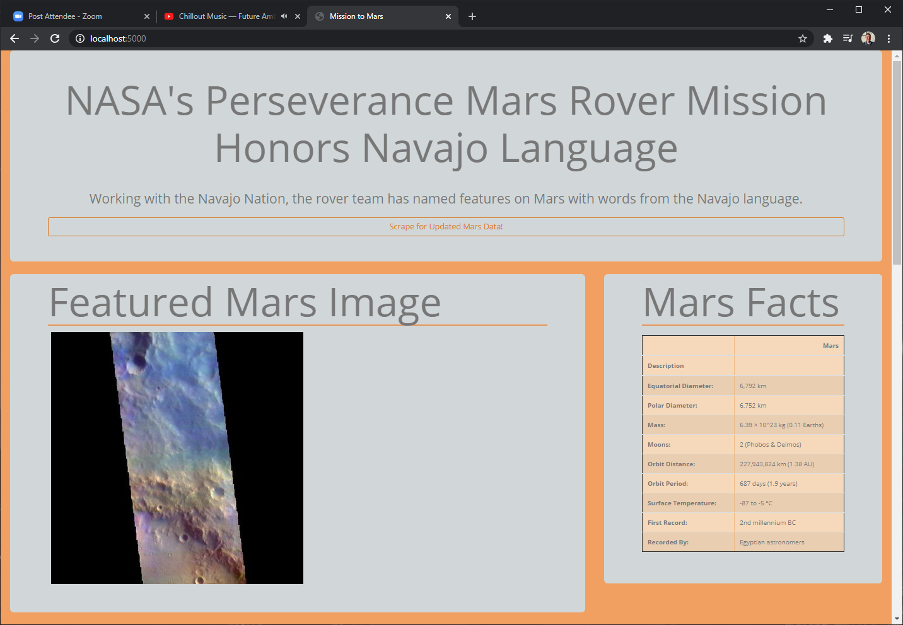
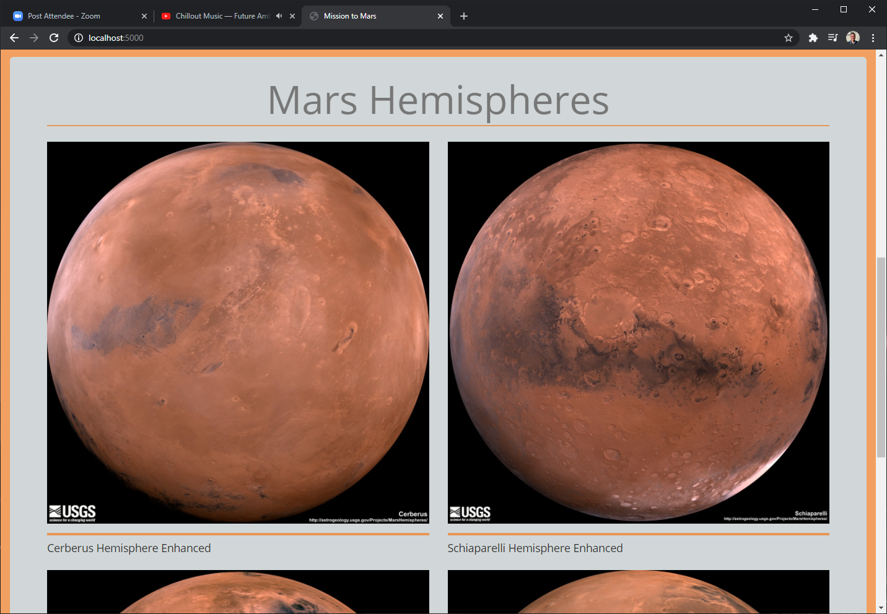
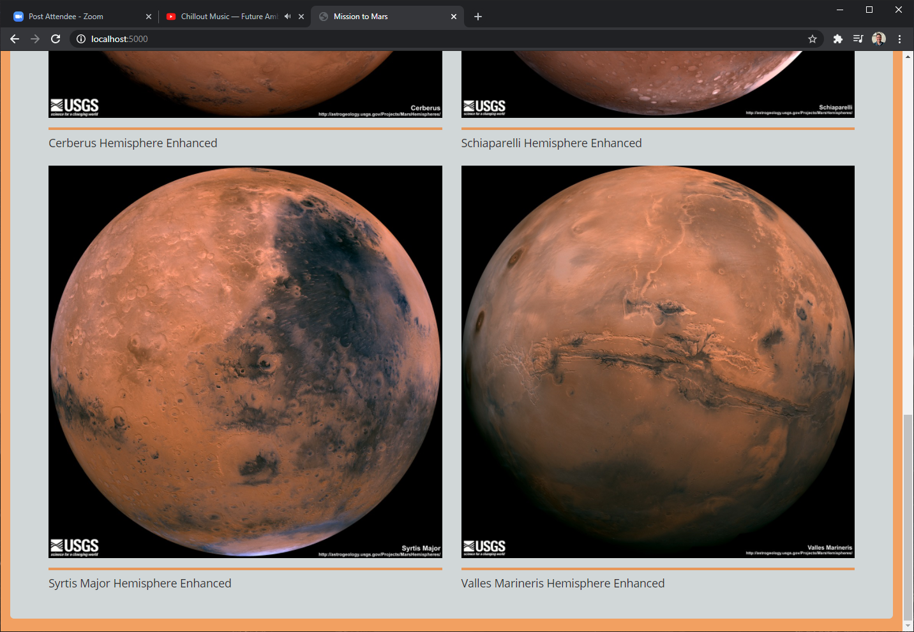

# web-scraping-challenge 
## {Mission To Mars}

---
## Background & Challenge

The goal of this project is to construct a web application that scrapes various websites for data related to the Mission to Mars and displays the information in a single HTML page.

#### Sources & Data
* [NASA Mars News Site](https://mars.nasa.gov/news/) : Collect the latest headline and teaser intro.

* [JPL Featured Space Image](https://www.jpl.nasa.gov/spaceimages/?search=&category=Mars): Grab the most recent image from the Mars collection.

* [Mars Facts](https://space-facts.com/mars/): Scrape a table of mars facts.

* [USGS Astrogeology](https://astrogeology.usgs.gov/search/results?q=hemisphere+enhanced&k1=target&v1=Mars): Scrape the full-size images of the Martian Hemispheres.

---
## Web Scraping, API Development, & Web Development Toolkit

* Python
* GitBash
* VS Code
* Pandas
* Splinter
* BeautifulSoup
* webdriver_manager
* time
* Flask
* Pymongo
* Jinja2
* HTML
* MongoDB
---
## Operating Instructions
* Install MongoDB Community Addition

* Clone this repository, maintaining directory paths

* Open GitBash/Terminal and install any missing dependencies as noted in the development toolkit section of the readme.md

* From Mission_to_Mars directory, open GitBash/Terminal, run app.py to initialize local server

* Open browser and navigate to http://localhost:5000/scrape: this will run the first scrape and build out the intial database and collection in mongoDB

* **The above scrape may take up to 90 seconds, so please be patient.**

* Once the first scrape is complete you're free to open from the home route at http://localhost:5000/

* From the home page, click on the "Scrape for Updated Mars Data" to refresh the feed. **The page may go down for up to 90 seconds while the fresh scrape is being completed**

---
## Application Screenshots

---

---
